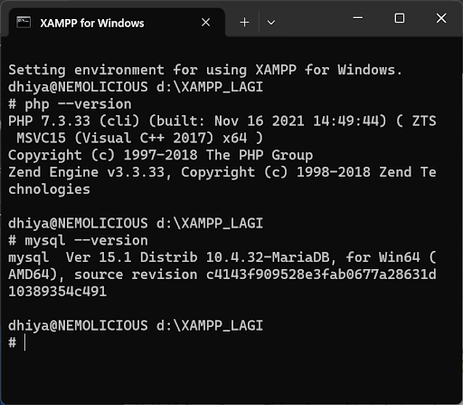

# Setup
As I've mentioned before, we are going to learn MySQL and PHP for the Back-End web development. But first thing first, you must have MySQL and PHP in your device. You can go to these websites either <a href="https://www.apachefriends.org/download.html">XAMPP</a> or Laragon to install the environment.

If it has been installed, you can check the version of PHP and MySQL by typing `php --version` and `mysql --version` in the command prompt.

The output will likely be as follow:

