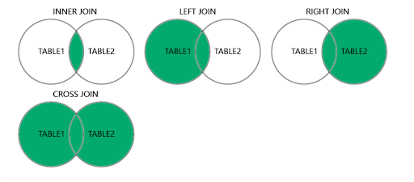

# MySQL Joins

MySQL joining tables are used to combine rows two or more tables based on related column between them.

Look at the following to tables:
#### Students Table
| id | student_id | name   | enrollment_year |
|----|------------|--------|-----------------|
| 1  | 1101224320 | Dhiya  | 2022            |
| 2  | 1101224319 | Dhea   | 2022            |
| 3  | 1101214320 | Deliza | 2021            |

<br/>   

#### Courses Table
| id | course_code | course_name                    | quota |
|----|-------------|--------------------------------|-------|
| 1  | TTIEP2      | Introduction to Nuclear        | 30    |
| 2  | TTUEP1      | Advance Computer Programming   | 30    |

<br/>

#### Students Course Table
| id | student_id | course_code |
|----|------------|-------------|
| 1  | 1101224320 | TTIEP2      |
| 2  | 1101224319 | TTIEP2      |
| 3  | 1101214320 | TTUEP1      |

<br/> 

For example, you want all the records that have matching values in both tables to be shown. You can execute following syntax:
```sql
SELECT students.student_id, students.name, students.enrollment_year, courses.course_code, courses.course_name
FROM students
INNER JOIN 
  	students_Course ON students.student_id = students_course.student_id
INNER JOIN 
	courses ON courses.course_code = students_course.course_code;
```

### Supported Types of Joins in MySQL
There are the other types of joins in MySQL beside inner join, you can find them out in the other tutorials for the detail:
- INNER JOIN: Returns records that have matching values in both tables
- LEFT JOIN: Returns all records from the left table, and the matched records from the right table
- RIGHT JOIN: Returns all records from the right table, and the matched records from the left table
- CROSS JOIN: Returns all records from both tables

<br/>
This is the visualization to help you to understand about joins:


