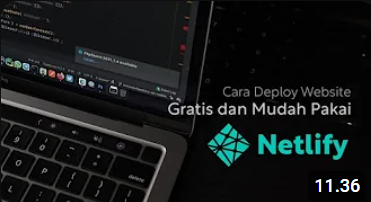

# 🌐 Netlify

Netlify is a cloud service platform designed to simplify the process of deploying and managing both static and dynamic web applications. It offers various advanced features that facilitate developers in building, deploying, and managing their websites.

## 🔧 Key Features

Netlify offers several key features:

- **Continuous Deployment**: Supports integration with version control systems like GitHub, GitLab, and Bitbucket for automating deployments whenever there are changes in the repository.
  
- **Serverless Functions**: Provides serverless functions that allow you to run backend code without managing servers.
  
- **Form Handling**: Simplifies form handling without requiring additional backend.
  
- **Custom Domain and HTTPS**: Supports custom domain usage and automatically enables HTTPS for security.

## 🚀 Using Netlify

### Steps to Use Netlify:

1. **Sign Up and Create an Account**: Visit the [Netlify website](https://www.netlify.com) and sign up to create a new account if you don't have one.

2. **Add Your Project**: After logging into the Netlify dashboard, click on "New Site from Git" to add your repository from the version control platform you use, such as GitHub.

3. **Configure Deployment Settings**: Select your repository and configure deployment settings, including build commands and environment variables.

4. **Deploy Your Application**: Each time you push changes to your repository, Netlify will automatically start the deployment process according to your configured settings.

5. **Monitor and Scale**: Utilize the dashboard's monitoring tools to track your site's performance and scale resources as needed.

## 🎥 References
### 🔗 [Netlify](https://www.netlify.com)
Dive into Netlify—an advanced platform for hosting web projects with features like continuous deployment, custom domains, and serverless functions. Learn how to harness its robust capabilities to streamline your web development workflow.
- **[Free and Easy Ways to Deploy a Website to the Internet Using Netlify](https://youtu.be/DoBmdxZxccA?si=NHwGiaWxTZdZ6yBH)**
  
    

- **[How to Deploy Static Website in Netlify ?](https://youtu.be/syyv1JN1ExE?si=WsMjQXkmM4Pxq_6h)**
  
    
  
