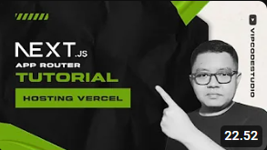

# Vercel 🚀

Vercel is a platform for modern web application deployment that supports both static and dynamic applications. It is designed with a focus on performance and ease of use, and it integrates strongly with the Next.js framework.

## Key Features 🔧

Some key features of Vercel include:

- **Full-Stack Deployment**: Supports deployment of full-stack applications, including those requiring server-side rendering.
  
- **Serverless Functions**: Provides serverless functions for running backend logic without managing server infrastructure.
  
- **Optimized for Next.js**: Vercel is optimized for applications built using the Next.js framework, ensuring optimal performance.
  
- **Analytics and Monitoring**: Provides tools for application performance analytics and monitoring to ensure smooth operation.

## Using Vercel 🌐

### Steps to Use Vercel:

1. **Sign Up and Create an Account**: Visit the [Vercel website](https://vercel.com) and sign up to create a new account if you don't have one.

2. **Add a Project**: After logging into the Vercel dashboard, click on "New Project" or "Import Project" to add your repository from the version control platform you use, such as GitHub.

3. **Configure Deployment**: Select the repository you wish to deploy. Vercel will detect default configurations for your project, including the framework being used.

4. **Deployment Settings**: Customize deployment settings as per your application's needs, including environment variables and custom domains if required.

5. **Deploy Your Application**: Click on "Deploy" to start the deployment process. Vercel will automatically build and host your application.

6. **Monitoring and Scaling**: Use the monitoring features in the Vercel dashboard to monitor your application's performance and scale it as needed.

## 🎥 References
### 🔗 [Vercel](https://vercel.com)
Explore Vercel—the optimal platform for deploying Next.js and other modern web applications. Dive into its seamless integration with Git, instant deployments, and global CDN for unparalleled performance.
- **[HOW TO HOST AN HTML CSS JS WEBSITE ON VERCEL FOR FREE](https://youtu.be/Kjw6pZJmqck?si=U7zZutNzDJIKp_fm)**
  
    

- **[How to Deploy/Host/Upload React JS on Vercel for Free](https://youtu.be/EOs0vmPoqQ0?si=FO138_Un_APPrlvQ)**
  
    
  
- **[Next JS Indonesian Pages Router Tutorial : 22.Hosting Vercel](https://youtu.be/eYe4FBe5h_c?si=w-7-AHYvHEFVOjoG)**
  
    
