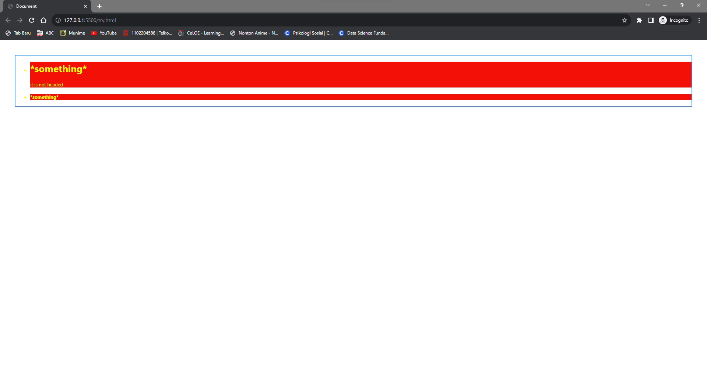

# COLOR
- `background-color` : to change a background of the selected selector
- `color`            : to change a component color
- `Border coloring`  : to change a border color
- ---
- ### Example : 

`/index.html`:
```html
<!DOCTYPE html>
<html lang="en">
    <head>
        <meta charset="UTF-8">
        <meta http-equiv="X-UA-Compatible" content="IE=edge">
        <meta name="viewport" content="width=device-width, initial-scale=1.0">
        <link rel="stylesheet" type="text/css" href="style.css">
        <title>Document</title>
    </head>
    <body>
        <ul>
            <li>
                <h1> *something* </h1>it is not headed
            </li>
            <li>
                <h4> *something* </h4>
            </li>

    </body>
</html>
```

`/stlye.css`:
```css
li {
    background-color: red;          /* background coloring */
    color: yellow;                  /* color */
    font-size: small;
}
ul {
    border: 2px solid DodgerBlue;    /* border coloring */
    margin: 40px;
}
```
#### <mark>Preview:</mark>
<div align = "center"></div>

> You can use those code for the next properties.
---
## COLOR VALUE

Color properties value could be in text like : green, red, black, etc., or in color code like RGB, HEX, and HSL.

- RGB  : `rgb(red, green, blue)` where red, green, and blue in integer within range 0-255.
```css
li {
    background-color: rgb(255, 0, 0);          /* red */
    color: rgb(255, 255, 0);                  /* yellow */
    font-size: small;
}
```    
- HEX  : `#rrggbb`, in hexadecimal -> for example #ffffff for white, #ff0000 for red.
```css
li {
    background-color: #ff0000;          /* red */
    color: #ffffff;                  /* white */
    font-size: small;
}
```    
- HSL  : `hsl(hue, saturation, lightness)`, in percent -> for example hsl(0, 100%, 50%) for red.
```css
li {
    color: hsl(0, 100%, 50%);          /* red */
    font-size: small;
}
```    
you can search for every color code in internet or automatically when you insert the color value at your stylesheet.

## OPACITY

- ### format :
```css
opacity : value; -> where value is percentage within 0-100%
```

Opacity used to set transparency of a selector.

If you set the value to 0%, it will make your selected selector **transparent**.

in rgba value, you can set the transparency:
```css
li 
{
    background-color: rgba(255, 0, 0, 0.5);   /* red with 30% transparency */
    color: rgb(255, 255, 0);                  /* yellow */
    font-size: small;
}
```

=================================

That's all for color, hope you can do it well, nice to meet you ^_^.
