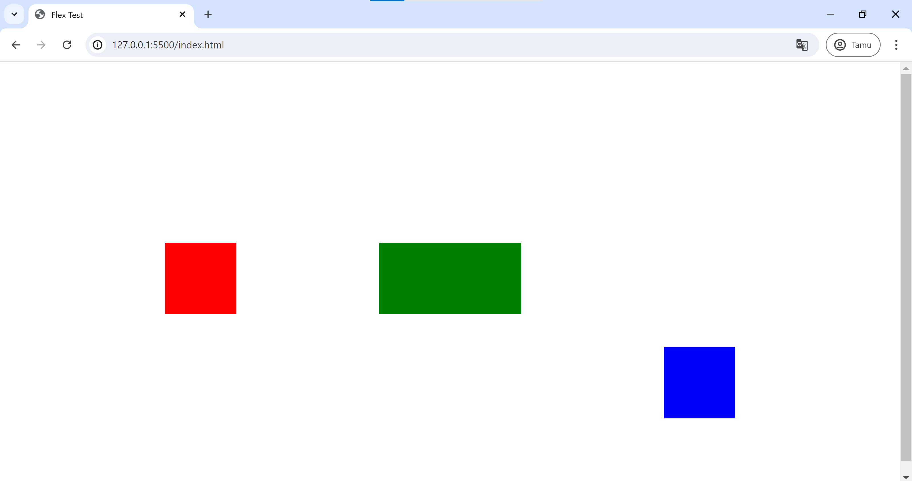

Next we will learn about `flex`

## Flexbox Elements
       +-------------------------------------------------------------------------------------+
       |      ___________           __________          __________                           |
       |     |           |         |          |        |          |                          |
       |     |     1     |         |     2    |        |    3     |                          |
       |     |           |         |          |        |          |            ^This         |
       |     |___________|         |__________|        |__________|             section      |
       |       ^The first item       ^The second item    ^The third item        is a         |
       |                                                                        container    |
       +-------------------------------------------------------------------------------------+


The element above represents a flex container with three flex items.

In the context of flex, we will explore two aspects: **flex containers** and **flex items**. 

Here are the properties and descriptions of **flex containers** :

|     Property     | Description |
|:----------------:|-------------|
| display          | Specifies the type of box used for an HTML element. |
| flex-direction   | The ‘flex-direction’ property defines in which direction the container wants to stack the flex items or specifies the direction of the flexible items inside a flex container. |
| flex-wrap        | The ‘flex-wrap’ property specifies whether the flex items should wrap or not, if there is not enough room for them on one flex line. |
| flex-flow        | The ‘flex-flow’ property is a shorthand property for setting both the ‘flex-direction’ and ‘flex-wrap’ properties. |
| justify-content  | The ‘justify-content’ property is used to align the flex items. Horizontally aligns the flex items when the items do not use all available space on the main-axis. |
| align-items      | The ‘align-items’ property is used to align the flex items. Vertically aligns the flex items when the items do not use all available space on the cross-axis. |
| align-content    | The ‘align-content’ property is used to align the flex lines. Modifies the behavior of the flex-wrap property. It is similar to align-items, but instead of aligning flex items, it aligns flex lines. |


Next, here are the properties and descriptions of **flex items** :

|     Property   | Description |
|:--------------:|-------------|
| order          | The ‘order’ property specifies the order of the flex items or of the flex items inside the same container. |
| flex-grow      | The ‘flex-grow’ property specifies how much a flex item will grow relative to the rest of the flex items or of the flex items inside the same container. |
| flex-shrink    | The ‘flex-shrink’ property specifies how much a flex item will shrink relative to the rest of the flex items or of the flex items inside the same container. |
| flex-basis     | The ‘flex-basis’ property specifies the initial length of a flex item. |
| flex           | The flex property is a shorthand property for the ‘flex-grow’, ‘flex-shrink’, and ‘flex-basis’ properties. |
| align-self     | The ‘align-self’ property specifies the alignment for the selected item inside the flexible container (overrides the flex container's align-items property). The ‘align-self’ property overrides the default alignment set by the container's align-items property. |

As an example of the application of flex containers and flex items, here is an HTML code that includes CSS with three items, namely red, green, and blue, where each of these items is styled with different flex properties : 

`/index.html`: 
```html.css
<!DOCTYPE html>
<html lang="en">
<head>
    <meta charset="UTF-8">
    <meta name="viewport" content="width=device-width, initial-scale=1.0">
    <title>Flex Test</title>
    <style>
        .flex-container {
            display: flex;
            height: 100vh;
            justify-content: center;
            align-items: center;
        }
        .square1 {
            width: 100px;
            height: 100px;
            margin: 100px;
            background-color: red;
            /*without the flex property of the item*/
        }
        .square2 {
            width: 100px;
            height: 100px;
            margin: 100px;
            background-color: green;
            flex-basis: 200px;
        }
        .square3 {
            width: 100px;
            height: 100px;
            margin: 100px;
            background-color: blue;
            align-self: flex-end;
        }
    </style>
</head>
<body>
    <div class="flex-container">
        <div class="square1"></div>
        <div class="square2"></div>
        <div class="square3"></div>
    </div>
</body>
</html>
```

click *preview* to see the result of the code above
<details>
<summary>
  
  #### Preview 
</summary>
<div align = "center"></div>
</details>

That's all for flex, hope you can do well, keep up the good work! ^_^.
