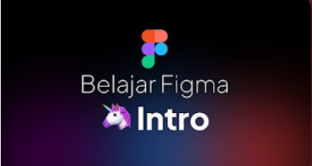
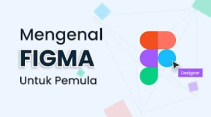

# Figma 🎨

Figma is a cloud-based graphic design tool used to create and manage user interface (UI) and user experience (UX) designs. Figma enables designers to collaborate in real-time, create interactive prototypes, and manage the entire design process from one integrated platform.

## Key Features of Figma

- **Cloud-Based**: Requires no software installation; accessible via web browsers.
- **Real-Time Collaboration**: Designers can work together simultaneously.
- **Interactive Prototyping**: Create and test interactive prototypes directly from designs.
- **Components and Variants**: Create reusable design elements and their variations for consistency.
- **Version Control**: Easily track changes and revisions to designs.
- **Integration with Other Tools**: Supports integration with tools like Slack, JIRA, and various plugins.

## 🎥 References
### 🔗 [Figma](https://www.figma.com/downloads/)
Explore Figma—the ultimate platform for designing and prototyping user interfaces. Dive into its collaborative features and seamless integration with various tools.
- **[Learn the Basics of Figma for Beginners - Indonesian Tutorial](https://youtube.com/playlist?list=PL2v2I2ywdCcePv7bSfzVoj8ffukZXyvxs&si=dCV4iKm8ZY-oPrf4)**
  
    

- **[Learn Figma](https://youtube.com/playlist?list=PLpOIyB53xzMjZVZDC_h38mIeMX7D9iA-g&si=ARSGgpKsiMHNJR1L)**
  
    
  
- **[Learn UI/UX Design](https://youtube.com/playlist?list=PLCGYmOfiRxUoFP9Swh9OxpNPbRqcFbB0u&si=TrtsluFae1C3E-nl)**
  
    
